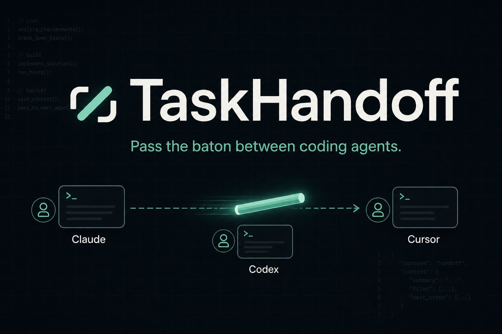
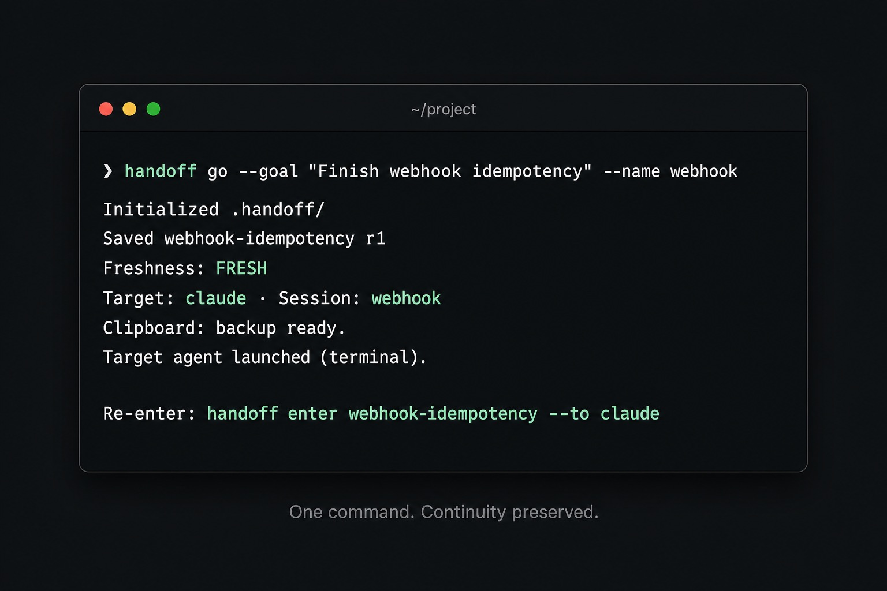
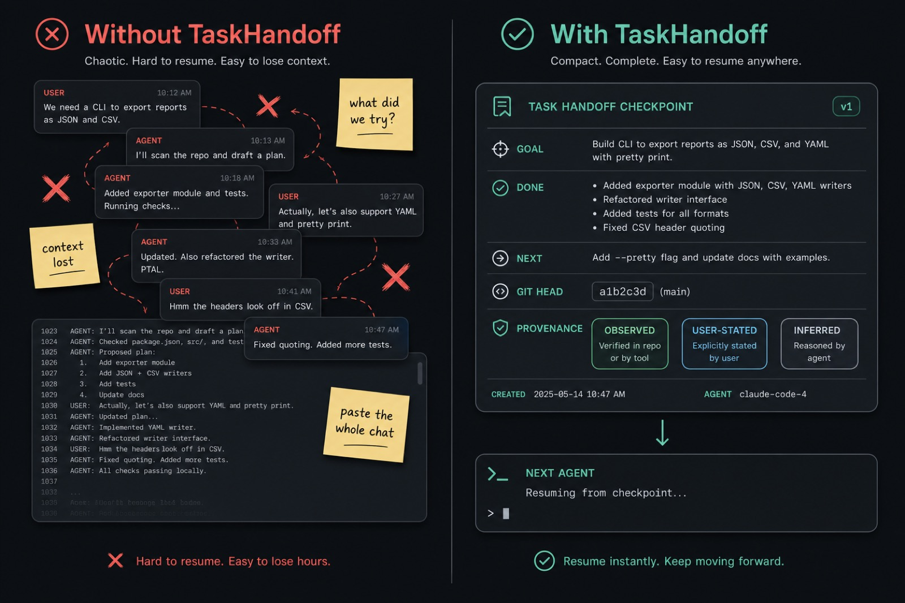
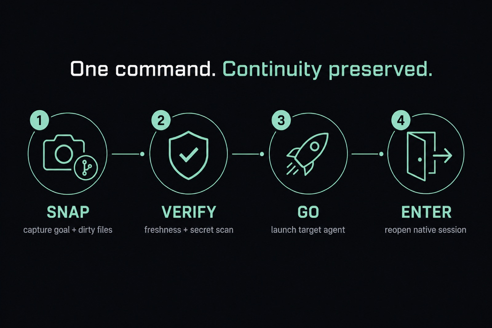

<p align="center">
  
</p>

<h1 align="center">TaskHandoff</h1>

<p align="center">
  <strong>Your agent hit a wall. Another one could finish the job.<br/>Don't paste a 200-message chat. Pass a baton.</strong>
</p>

<p align="center">
  Claude Code · Codex · OpenCode · Copilot CLI · Cursor · Humans
</p>

<p align="center">
  <a href="#install"></a>
  <a href="#install"></a>
  <a href="LICENSE"></a>
</p>

---

## The demo

<p align="center">
  
</p>

<p align="center">
  <a href="docs/assets/demo.svg"><em>▶ Open the looping terminal animation (SVG)</em></a>
</p>

One command captures where you are, verifies Git evidence, secret-scans the recovery prompt, and launches the next agent with everything it needs — goal, decisions, failed attempts, next action, and provenance.

```bash
handoff go --goal "Finish webhook idempotency" --name webhook
```

---

## The pain you already know

You know this feeling:

- The model is thrashing on a bug it already failed to fix twice
- Codex would crush the refactor, but Claude has all the context
- You open a fresh session and spend 15 minutes re-explaining the world
- Someone dumps the entire transcript into chat — and half of it is wrong, stale, or secret-adjacent
- The new agent happily retries the approach you already rejected

**Context switching between coding agents shouldn't feel like amnesia.**

<p align="center">
  
</p>

TaskHandoff replaces “copy the whole chat” with a **small, verifiable checkpoint**:

| What moves | What stays behind |
|---|---|
| Goal, acceptance, next action | Raw transcripts |
| Confirmed decisions + failed attempts | Hidden chain-of-thought |
| Git HEAD, dirty files, file hashes | Full diffs and credentials |
| Provenance labels (`observed` / `user-stated` / `agent-inferred`) | Wishful memory |

The receiving agent is told exactly what to trust — and what to re-verify before touching code.

---

## How the baton pass works

<p align="center">
  
</p>

```text
snap   →  capture goal + dirty files in one breath
verify →  freshness check + secret scan (non-negotiable)
go     →  deliver prompt, copy fallback, launch target CLI
enter  →  reopen the native Claude / Codex / OpenCode session you launched
```

No DAG orchestrator. No multi-agent religion. Just continuity you can prove.

---

## Install

```bash
npm install -g agent-task-handoff
handoff doctor
```

Or try once:

```bash
npx agent-task-handoff doctor
```

Requires **Node.js 20+** and a Git repository.

---

## 30-second start

```bash
cd your-repo

# See what's ready
handoff

# Save progress from a goal + current dirty files
handoff snap --goal "Prevent duplicate webhook credits"

# Save AND hand off (auto-picks a target when it can)
handoff go --goal "Prevent duplicate webhook credits" --name webhook

# Come back later to the launched session
handoff enter
```

That's it. `init` is optional. Dirty files become context refs automatically. `--next` defaults to your goal. Secret scanning cannot be bypassed.

---

## Why teams reach for this

### “Claude is stuck. Give it to Codex.”
`handoff go --to codex --name same-thread-name`  
Fresh agent. Same mission. Failed approaches labeled so they don't get retried for sport.

### “I need to continue tomorrow without reloading 40k tokens of chat.”
`handoff snap --goal "..."` today → `handoff go` tomorrow.  
Checkpoint stays local under `.handoff/` (gitignored by default).

### “Hand this to a teammate who isn't in my IDE.”
`handoff go --to human` or `handoff export --format markdown`  
They get a readable brief — not your API keys.

### “Don't launch anything. Just put the recovery prompt on my clipboard.”
`handoff go --no-exec`  
Open any agent. Paste once. Done.

---

## Works with your agents

| Target | Prompt / copy | Safe launch | Rescue prior session | Re-enter |
|---|:-:|:-:|:-:|:-:|
| Claude Code | ✅ | `claude` | ✅ | `handoff enter` |
| Codex | ✅ | `codex` | ✅ | `handoff enter` |
| OpenCode | ✅ | `opencode` | ✅ | `handoff enter` |
| GitHub Copilot CLI | ✅ | `copilot` | use `snap` / `go --goal` | `handoff enter` (weak: re-injects prompt) |
| Cursor (`agent`) | ✅ | `agent` | use `snap` / `go --goal` | `handoff enter` (weak: `agent resume`) |
| Human | Markdown | — | — | — |

Launch never enables permission/sandbox bypass flags. If a CLI isn't installed, you still get a secret-scanned prompt file.

---

## Agent-native, not CLI-only

Ship the baton from *inside* the agent:

- **Claude Code** — Plugin + `/handoff`
- **Codex** — Plugin + `$handoff-task`
- **Cursor / Copilot / OpenCode** — shared Skill at `~/.agents/skills/handoff-task`

```text
/handoff
/handoff codex
/handoff cursor
/handoff rescue codex
```

Say it in plain language: *“save where we are and continue in Codex.”*

---

## Trust is the product

Every important line carries provenance:

- **observed** — backed by files, Git, tests, or tools
- **user-stated** — you said it
- **agent-inferred** — treat as a hypothesis until checked

Plus:

- Freshness validation before resume
- Secret scanning before save / copy / export / launch
- Immutable revisions (no silent overwrite)
- Portable export that excludes transcripts, env vars, and full diffs

Deep dive: [architecture](docs/architecture.md) · [security](docs/security.md) · [schema](docs/handoff.schema.json)

---

## More power when you need it

<details>
<summary><strong>Rescue a prior Claude / Codex / OpenCode session</strong></summary>

```bash
handoff go --from claude --to codex
handoff rescue --from codex --to opencode --copy
handoff go --from claude --to codex --summarize   # opt-in; may use model tokens
```

Extracted claims are marked `agent-inferred` until you review them.

</details>

<details>
<summary><strong>Re-enter a launched session</strong></summary>

```bash
handoff enter
handoff enter webhook --to claude
handoff enter webhook --to codex
handoff enter webhook --to opencode
```

Claude resumes by preallocated UUID. Codex resumes by recorded name, or `codex resume --last`. OpenCode resumes the newest matching session for the repository (`opencode --continue`, or an explicit `ses_*` id when `session list` can resolve by cwd, title, and launch time). Cursor uses `agent resume`. Copilot re-injects the saved handoff prompt from the launch receipt.

</details>

<details>
<summary><strong>Portable checkpoints & linear workflows</strong></summary>

```bash
handoff export webhook --format markdown --output webhook.md
handoff import webhook.handoff.json

handoff workflow init feature --file examples/workflow.yaml
handoff workflow next feature
handoff workflow advance feature --outcome done --checkpoint feature-r1
```

</details>

<details>
<summary><strong>Local development</strong></summary>

```bash
pnpm install
pnpm build
pnpm link --global
pnpm test
pnpm sync:integrations   # after editing the canonical Skill
```

</details>

---

## License

MIT — use it, fork it, pass the baton.
